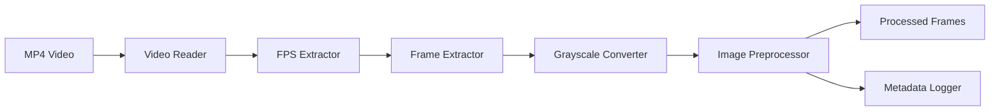

# Video ML Pipeline - Phase 1

## 1. Project Overview
This repository contains a modular, research-grade video preprocessing pipeline designed for transforming raw MP4 video data into standardized frame sequences. It is engineered with reproducibility, strict memory management (via streaming), and robust error handling in mind, ensuring a pristine data ingest for downstream machine learning applications.

## 2. Research Motivation
**Why this exists:**
Most depression-detection repositories focus on model architectures while treating preprocessing as a black box. This project aims to build a reproducible, auditable preprocessing foundation before introducing facial analysis and machine learning models. 

In affective computing and depression detection tasks, the quality of the preprocessing pipeline dictates the ceiling of the machine learning model's performance. Deep neural networks operating on noisy, incorrectly formatted, or poorly tracked datasets yield inconsistent and unreliable results. This pipeline aims to establish a strictly versioned, highly observable, and defensively programmed foundation, guaranteeing that the inputs provided to the deep learning models are standardized and auditable.

## 3. Pipeline Architecture
The architecture is structured sequentially, avoiding centralized god-classes and relying on single-responsibility modules coordinated by a thin orchestrator:



Data is passed between these stages using a strictly slotted `FrameRecord` dataclass, ensuring that crucial temporal metadata travels with the pixel data without massive memory overhead.

## 4. Phase 1 Scope
**Phase 1 exclusively handles foundational ingest and formatting.**
It takes a raw `.mp4`, validates it, streams its frames as arrays, standardizes them to 2D grayscale, applies a naive center crop, resizes them to the target tensor dimensions (e.g., 224x224), and logs a comprehensive JSON audit trail. 

## 5. Project Structure
```
Video ML Pipeline/
├── data/
│   ├── raw/
│   ├── processed/
│   └── metadata/
├── docs/
├── src/
│   ├── config.py
│   ├── exceptions.py
│   ├── fps_extractor.py
│   ├── frame_extractor.py
│   ├── grayscale_converter.py
│   ├── image_preprocessor.py
│   ├── metadata_logger.py
│   ├── pipeline.py
│   ├── video_reader.py
│   └── models/
│       └── frame_record.py
└── tests/
```

## 6. Installation
Ensure you have Python 3.9+ installed.
```bash
pip install opencv-python numpy pytest
```

## 7. Usage
To execute the pipeline orchestrator on a video:
```python
from pathlib import Path
from pipeline import process_video

metadata_file = process_video(Path("data/raw/sample.mp4"))
print(f"Pipeline finished. Audit trail saved to: {metadata_file}")
```

## 8. Example Output
The output for a processed video `sample.mp4` will result in a directory structure like:
```
data/
└── processed/
    └── sample/
        ├── frame_000000.jpg
        ├── frame_000001.jpg
        └── ...
```

## 9. Metadata Schema
An audit trail is generated for each run in `data/metadata/sample_metadata.json`:
```json
{
  "pipeline_name": "video_preprocessing",
  "pipeline_phase": "phase_1",
  "pipeline_version": "1.0.0",
  "video_name": "sample.mp4",
  "fps": 30.0,
  "width": 1280,
  "height": 720,
  "duration_seconds": 15.0,
  "total_frames": 450,
  "processed_frames": 450,
  "failed_frames": 0,
  "skipped_frames": 0,
  "output_width": 224,
  "output_height": 224,
  "processing_started_at": "2025-01-01T12:00:00+00:00",
  "processing_completed_at": "2025-01-01T12:01:30+00:00",
  "processing_duration_seconds": 90.0
}
```

## 10. Testing
Comprehensive integration and unit tests are included, utilizing `unittest.mock` for external I/O simulations.
```bash
python -m pytest tests/
```

## 11. Design Decisions
- **Fail-Fast Philosophy**: Exceptions use a targeted hierarchy (`PipelineError` -> `VideoError`, etc.) to surface precise points of failure immediately rather than guessing or silently attempting to repair corrupted metadata (e.g., negative FPS).
- **Streaming over Batching**: Video data is pulled from the decoder as a generator, keeping memory usage constant regardless of video length.
- **Atomic Metadata Writes**: The `MetadataLogger` utilizes `.tmp` files to guarantee that failed executions do not leave corrupted JSON schemas behind.

## 12. Limitations
> [!WARNING]
> **Current Limitations**
> - Uses center crop rather than face crop
> - No face detection
> - No face alignment
> - No quality filtering
> - No feature extraction
> - No depression classification
> 
> *Note: This phase does not contain facial analysis. It is purely foundational video processing.*

## 13. Future Roadmap
- **Phase 2:** Face Extraction (Face Detection, Cropping, Alignment, and Quality Filtering)
- **Phase 3:** Feature Extraction
- **Phase 4:** Deep Learning Modeling (Depression Classification)
