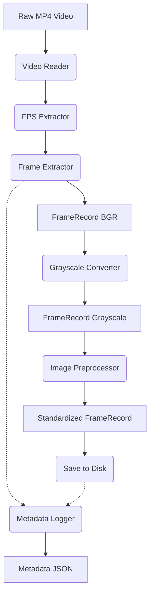

# Video Preprocessing Pipeline Architecture

## Overall Pipeline Flow
The Video Preprocessing Pipeline is designed to ingest raw MP4 video files and sequentially process them into a standardized format suitable for downstream machine learning tasks. The flow is strictly linear for Phase 1:
1. **Ingestion**: A raw `.mp4` video is loaded.
2. **Metadata Extraction**: Essential video properties like FPS, width, height, and total frames are extracted.
3. **Frame Iteration**: The video is decoded frame by frame.
4. **Transformation**: Each frame is wrapped in a `FrameRecord` dataclass, undergoes grayscale conversion, followed by standardization (center crop and resizing to target dimensions specified in config).
5. **Storage**: Processed frames are saved to disk, accompanied by a generated JSON metadata file.
6. **Logging**: All events and errors are recorded in a central `logs/processing.log`.

## Module Responsibilities
- **Video Reader (`video_reader.py`)**: Handles safe file opening, existence validation, and graceful error management via custom exceptions.
- **FPS Extractor (`fps_extractor.py`)**: Retrieves and validates the frames-per-second metric from the video stream.
- **Frame Extractor (`frame_extractor.py`)**: Manages the sequential reading and yielding of frames, wrapping them in `FrameRecord` objects.
- **Grayscale Converter (`grayscale_converter.py`)**: Transforms multi-channel (RGB/BGR) frames within the `FrameRecord` into single-channel grayscale arrays.
- **Image Preprocessor (`image_preprocessor.py`)**: Applies standardized cropping and resizes the output to target dimensions defined in `config.py`.
- **Metadata Logger (`metadata_logger.py`)**: Compiles execution statistics and video properties into a versioned JSON format.
- **Config (`config.py`)**: Centralized configuration file for pipeline parameters.
- **Exceptions (`exceptions.py`)**: Defines custom exception classes.
- **Frame Record (`models/frame_record.py`)**: Dataclass to pass frame state (index, timestamp, image data) between modules cleanly.
- **Pipeline Orchestrator (`pipeline.py`)**: The central coordinator that links all modules together and executes the end-to-end workflow with CLI arguments.

## Data Flow Between Modules



## Folder Structure
```text
video-preprocessing/
│
├── docs/
│   ├── ARCHITECTURE.md
│   ├── DESIGN_DECISIONS.md
│   ├── IMPLEMENTATION_PLAN.md
│   └── ASSUMPTIONS.md
│
├── data/
│   ├── raw/
│   ├── processed/
│   └── metadata/
│
├── logs/
│   └── processing.log
│
├── src/
│   ├── models/
│   │   └── frame_record.py
│   ├── config.py
│   ├── exceptions.py
│   ├── video_reader.py
│   ├── fps_extractor.py
│   ├── frame_extractor.py
│   ├── grayscale_converter.py
│   ├── image_preprocessor.py
│   ├── metadata_logger.py
│   └── pipeline.py
│
├── tests/
│
├── requirements.txt
│
└── README.md
```

## Future Depression Pipeline Roadmap
This preprocessing pipeline (Phase 1) is the foundation of a broader research initiative:
- **Phase 1**: Video Preprocessing (Current)
- **Phase 2**: Face Detection & Face Alignment
- **Phase 3**: Feature Extraction
- **Phase 4**: Pretrained Model Integration
- **Phase 5**: Depression Classification
- **Phase 6**: Evaluation and Explainability
