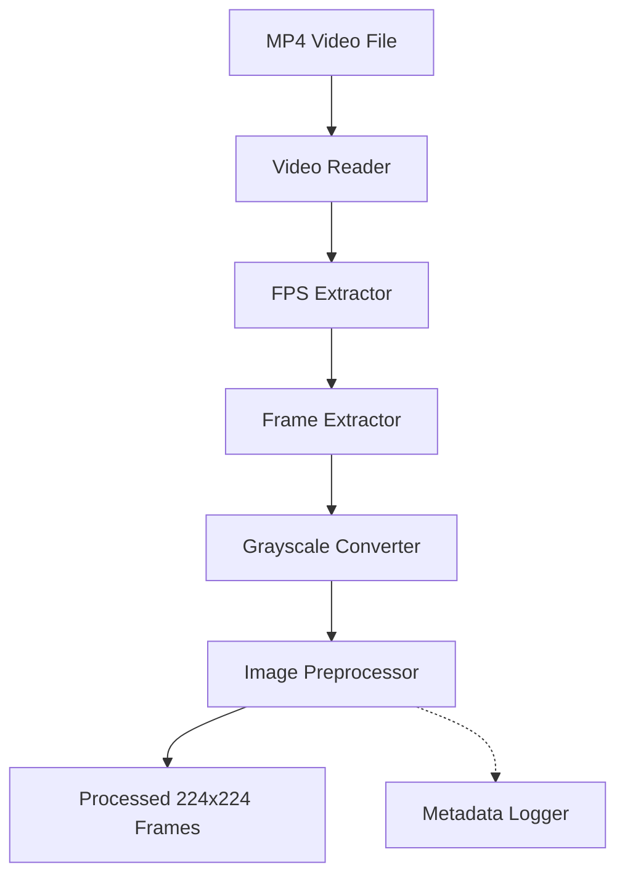
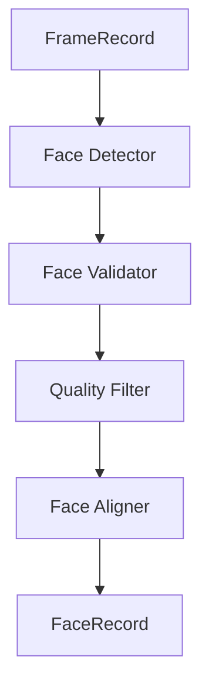

# Phase 1 and Phase 2 Technical Walkthrough

## 1. Project Purpose
This project implements a research-grade video preprocessing and facial extraction pipeline. It is specifically designed as the foundational data-ingestion layer for future machine learning systems targeting depression detection from clinical video interviews. 

**Important:** This current implementation does *not* perform depression classification, feature extraction, or temporal modeling. Its sole purpose is to transform raw, noisy video files into a stable sequence of high-fidelity, geometrically aligned facial representations that future deep learning architectures can consume reliably.

## 2. Why Preprocessing Matters
In affective computing and clinical machine learning, preprocessing often dictates the ceiling of model performance more than the choice of neural network architecture. If a model is fed raw video frames, it is forced to learn invariance to:
- **Noise & Blur:** Camera compression artifacts and motion blur destroy subtle micro-expressions.
- **Pose Variation:** Head movements (pitch, yaw, roll) distort facial geometry.
- **Face Size Variation:** Subjects sitting closer or further from the camera change the spatial frequency of features.
- **Inconsistent Framing:** Background environments act as confounding variables (models may learn to classify the room rather than the patient).
- **Occlusions:** Hands over the face or poor lighting obscure the clinical signal.

Proper preprocessing standardizes these variables, allowing downstream ML models to dedicate their parameter capacity entirely to learning clinical biomarkers rather than spatial normalization.

## 3. Evolution of the Architecture
The project evolved in two distinct, decoupled phases to separate broad video manipulation from specialized facial extraction.

**Phase 1** focuses purely on video ingestion and standardization. It handles:
- Video file reading
- FPS extraction
- Frame extraction
- Grayscale conversion
- Basic image standardization (center cropping and resizing)

**Phase 2** focuses on clinical signal extraction. It handles:
- Face detection
- Quality validation
- Blur filtering
- 5-point affine alignment

Phase 2 was deliberately separated from Phase 1. Phase 1 guarantees that *any* video can be successfully read and standardized into a common memory format. Phase 2 takes that stable input and applies computationally expensive, domain-specific algorithms. This separation allows researchers to debug video-decoding issues independently from facial-alignment issues.

## 4. Phase 1 Walkthrough
Phase 1 consists of several tightly scoped modules.

- **Video Reader (`video_reader.py`)**
  - *Responsibility:* Safely opens the video file and handles missing/corrupted file scenarios.
  - *Inputs/Outputs:* Takes a `Path`, returns a `cv2.VideoCapture` object.
  - *Design:* Explicitly fails fast with a `VideoNotFoundError` or `VideoOpenError` rather than returning a silent `None`.
- **FPS Extractor (`fps_extractor.py`)**
  - *Responsibility:* Retrieves and validates the video frame rate.
  - *Design:* Specifically checks for `NaN`, `Inf`, and `<= 0` values, as OpenCV frequently returns impossible FPS values for corrupted headers.
- **Frame Extractor (`frame_extractor.py`)**
  - *Responsibility:* Yields frames sequentially via a Python generator.
  - *Inputs/Outputs:* Yields `FrameRecord` objects containing the image array, frame index, and timestamp.
  - *Design:* A generator avoids loading the entire video into RAM, enabling the processing of hour-long clinical interviews. It calculates timestamps manually using `frame_index / fps` to avoid relying on OpenCV's notoriously buggy internal timestamp properties.
- **Grayscale Converter (`grayscale_converter.py`)**
  - *Responsibility:* Strips color channels.
  - *Validations:* Rejects inputs that do not strictly possess 3 dimensions to prevent channel-mixing bugs.
- **Image Preprocessor (`image_preprocessor.py`)**
  - *Responsibility:* Applies a deterministic center crop and resizes the image to 224×224.
  - *Design:* Center cropping normalizes the aspect ratio perfectly before resizing, preventing spatial distortion (stretching or squashing) of the face.
- **Metadata Logger (`metadata_logger.py`)**
  - *Responsibility:* Saves an atomic JSON audit trail of the processing run.
- **Pipeline Orchestrator (`pipeline.py`)**
  - *Responsibility:* Wires the modules together, manages the `try-finally` execution blocks, and guarantees resource cleanup (`cap.release()`).

## 5. Phase 1 Data Flow

Data transitions elegantly through the pipeline: the file is opened, FPS is read, the generator yields frames one by one, each frame is stripped of color, cropped/resized, and finally saved to disk. Metadata is compiled concurrently and written atomically upon completion.

## 6. Why OpenCV Was Chosen
OpenCV (`cv2`) was selected over alternatives like `ffmpeg-python`, `scikit-image`, or `Pillow`:
- **Maturity:** It is the industry standard for C++ backed video processing.
- **Performance:** Most operations drop directly down to highly optimized C/C++ routines.
- **Research Adoption:** It interfaces seamlessly with NumPy, making it universally compatible with PyTorch and TensorFlow datasets.

## 7. Why Grayscale Was Used
Grayscale conversion was strictly enforced in Phase 1 for three reasons:
- **Memory Reduction:** Reduces the data footprint by 66%, drastically speeding up disk I/O and RAM usage for large datasets.
- **Computational Efficiency:** Downstream 3D-CNNs require significantly fewer FLOPs when processing single-channel data.
- **Removal of Color Bias:** Clinical videos suffer from extreme lighting variations (fluorescent vs. natural light) and disparate camera white-balancing. Grayscale forces the model to focus on structural topography (muscle movements) rather than illumination artifacts.

## 8. Why 224×224 Was Chosen
The 224×224 resolution is the de-facto standard for deep learning computer vision.
- **CNN Compatibility:** Models like ResNet, EfficientNet, and VGG were trained on 224×224 inputs.
- **ViT Compatibility:** Vision Transformers (ViTs) divide images into 16×16 patches. 224 is perfectly divisible by 16 (14×14 patches).
- **ImageNet Conventions:** Standardizing to 224 allows us to utilize pre-trained ImageNet weights for transfer learning without architecture modifications.

## 9. Phase 1 Metadata System
The metadata system captures fields such as `fps`, `total_frames`, `processed_frames`, and `processing_duration_seconds`. 
In research, **auditability** and **reproducibility** are paramount. If a model behaves erratically, the metadata JSON allows researchers to trace exactly which version of the pipeline processed the data, how many frames were dropped, and if the video's original FPS was anomalous.

## 10. Phase 2 Motivation
While Phase 1 produces clean video frames, naive center cropping is insufficient for depression detection. 
Depression is largely characterized by subtle facial biomarkers:
- **Facial Affect:** Micro-expressions of sadness or flat affect.
- **Psychomotor Retardation:** Slowed facial muscle dynamics.
- **Reduced Expressivity:** Lack of animated responses.
A center crop leaves the face bouncing around the frame as the patient shifts in their seat. If the head pose varies, the CNN must learn to mentally "rotate" the face. Phase 2 explicitly isolates the facial signal and geometrically normalizes it, ensuring the ML model only looks at the clinical cues.

## 11. Phase 2 Architecture

Responsibilities are heavily separated. The detector *only* detects. The validator *only* checks basic geometries and confidence. The quality filter *only* measures image fidelity (blur). The aligner *only* performs matrix math. This prevents monolithic "spaghetti" code where a single function handles everything poorly.

## 12. Why RetinaFace Was Selected
Several detectors were evaluated:
- **Haar Cascades:** Outdated, highly sensitive to lighting and angles.
- **Dlib HOG:** Robust baseline but fails frequently on non-frontal (profile) faces.
- **MTCNN:** A strong historical choice, but computationally heavier and less accurate than modern single-stage detectors.
- **MediaPipe:** Blazing fast for real-time applications, but bounding boxes can be slightly jittery frame-to-frame.
- **RetinaFace (InsightFace):** The winner. It is a state-of-the-art single-stage detector that provides unparalleled bounding box stability, excellent occlusion handling, and natively exports 5-point facial landmarks required for alignment. 

The `insightface` package was chosen as the backend because it is actively maintained, highly optimized, and seamlessly integrates into modern Python stacks.

## 13. Largest Face Selection Rule
In a clinical interview setting, a video might inadvertently capture the clinician, a reflection, or a picture on the wall. To solve the "multiple faces" problem, the pipeline enforces a strict **largest face by bounding-box area** heuristic. Because the camera is focused on the patient, the patient's face will invariably occupy the largest pixel area, guaranteeing consistent subject tracking.

## 14. 20% Margin Expansion
After detection, the bounding box is artificially expanded by 20% in all directions before cropping. 
Without this expansion, modern tight bounding boxes often cut off the jawline, chin, and upper forehead. In affective computing, jaw clenching and forehead wrinkling are critical signals. Expanding the box ensures the entire facial context is preserved for the alignment and feature-extraction phases.

## 15. FaceRecord Deep Dive
`FaceRecord` is the primary transport object for Phase 2.
- `frame_index` & `timestamp_seconds`: Temporal tracking.
- `image`: The facial crop (stateful: represents the unaligned crop initially, and the 112x112 aligned image at the end).
- `face_bbox`: The exact coordinates `(x, y, w, h)` where the face was found.
- `detection_confidence`: Network certainty of the face.
- `landmarks`: The (5, 2) array of facial features.
- `face_area_ratio`: How much of the screen the face occupied.
- `laplacian_variance`: The calculated sharpness of the image.

It uses `slots=True` to eliminate the `__dict__` overhead in Python objects, drastically reducing memory footprint when holding thousands of records in RAM.

## 16. Face Validation Layer
Before any heavy mathematical alignment occurs, `face_validator.py` acts as a firewall:
1. **Confidence Threshold:** Rejects faces with `< 0.8` confidence.
2. **Face Area Threshold:** Rejects faces that occupy `< 5%` of the frame (tiny background faces lack clinical detail).
3. **Landmark Verification:** Ensures exactly 5 points exist.
This layer fails fast, preventing wasted compute on false positives.

## 17. Blur Detection Strategy
`quality_filter.py` computes the **Laplacian variance** (`cv2.Laplacian(image).var()`). The Laplacian operator measures the 2nd derivative of an image, effectively highlighting edges. A blurry image lacks sharp edges, resulting in a low variance. 
Blur destroys the textural details needed for depression detection. The threshold `100.0` is currently marked as experimental because different camera sensors and lighting conditions inherently produce different baseline variances; it must be empirically tuned against the final dataset.

## 18. Face Alignment Deep Dive
Alignment mathematically maps a distorted face onto a canonical template using a Similarity Transform (Affine translation, rotation, and uniform scaling).
- It relies on 5 canonical landmarks: Left Eye, Right Eye, Nose, Left Mouth, Right Mouth.
- We utilize the standardized **ArcFace reference points**. 
- Using `cv2.estimateAffinePartial2D`, we compute a matrix that rotates and scales the detected points to perfectly match the reference points, and then warp the image pixels accordingly.
- This results in the eyes and nose appearing in the exact same pixel coordinates across every single frame of the video.
- The output size is **112×112** because the ArcFace reference coordinates are explicitly calibrated for a 112×112 grid. We can subsequently resize this to 224x224 for CNN ingestion if needed.

## 19. Exception Hierarchy
A granular exception hierarchy was designed to prevent silent failures:
- `PipelineError`: Base exception.
  - `VideoError`: I/O failures.
  - `FaceProcessingError`: Base for Phase 2.
    - `FaceNotFoundError`: No face or empty crop.
    - `FaceValidationError`: Fails confidence/size rules.
    - `FaceQualityError`: Fails Laplacian blur threshold.
    - `FaceAlignmentError`: Matrix math failure.
This structure allows the orchestrator to catch specific failures, route them to the correct debug logging bins, and continue processing the video without crashing.

## 20. Testing Strategy
Testing guarantees architectural stability.
- **Unit Tests:** Verify deterministic behaviors (e.g., cropping logic, FPS math).
- **Integration Tests:** Verify module composition. The Phase 2 integration test uses `unittest.mock` to simulate RetinaFace outputs, effectively generating 6 test scenarios:
  1. Happy path (full success).
  2. No face detected.
  3. Low confidence.
  4. Tiny face.
  5. Blurry face.
  6. Alignment transform failure.
This testing strategy verifies dataset safety—ensuring edge cases are handled gracefully without terminating the pipeline.

## 21. Metadata and Debug Infrastructure
Phase 2 generates an independently versioned `_metadata_phase2.json` containing metrics like `faces_aligned`, `average_detection_confidence`, and distributional bounds (`min/max_laplacian_variance`). 
Crucially, when a frame fails validation or quality checks, it is routed to `data/debug/[category]/`. A global cap of **50 samples** per category is strictly enforced. This prevents storage explosion while providing researchers with a highly curated sample of rejected images to intuitively understand why data was dropped.

## 22. Engineering Principles Used
- **Single Responsibility Principle:** Every `.py` file does exactly one thing.
- **Immutability:** Dataclasses return *new* instances rather than mutating in-place.
- **Fail-Fast Validation:** Broken inputs are rejected immediately at instantiation (`__post_init__`).
- **Auditability/Reproducibility:** JSON metadata tracks every algorithmic decision.
- **Modular Design:** Phase 2 logic lives entirely separate from Phase 1 logic.
- **Streaming Processing:** Python generators ensure memory efficiency.

## 23. Current Capabilities
As of this milestone, the pipeline can:
- Safely open and read arbitrary clinical MP4s.
- Extract frames sequentially with timestamps.
- Apply InsightFace RetinaFace detection.
- Select primary subjects via dynamic bounding-box logic.
- Filter out false-positives, tiny faces, and blurred frames.
- Mathematically align faces to a canonical 112x112 ArcFace template.
- Export highly detailed JSON audit trails.
- Capture categorized diagnostic failure samples.

## 24. Current Limitations
- **No Feature Extraction:** The pipeline outputs image arrays, not embedding vectors.
- **No Temporal Modeling:** It processes frame-by-frame; it does not yet understand temporal relationships (e.g., optical flow, RNNs).
- **No Multimodal Fusion:** It only processes vision; audio and text modalities are currently ignored.
- **No Depression Classifier:** It does not make clinical predictions.
- **No Severity Prediction:** It cannot regress PHQ-8 or HAM-D scores.

## 25. Future Roadmap
- **Phase 3 (Feature Extraction):** Passing the 112x112 aligned crops through a pre-trained CNN (e.g., ResNet-50) or ViT to extract dense spatial embeddings.
- **Phase 4 (Temporal Modeling):** Feeding sequential frame embeddings into an LSTM, GRU, or Temporal Convolutional Network (TCN) to capture dynamics like psychomotor retardation.
- **Phase 5 (Multimodal Fusion):** Integrating audio spectrograms (MFCCs) and NLP transcript embeddings.
- **Phase 6 (Severity Prediction):** Training regression heads to output standardized clinical depression metrics.
